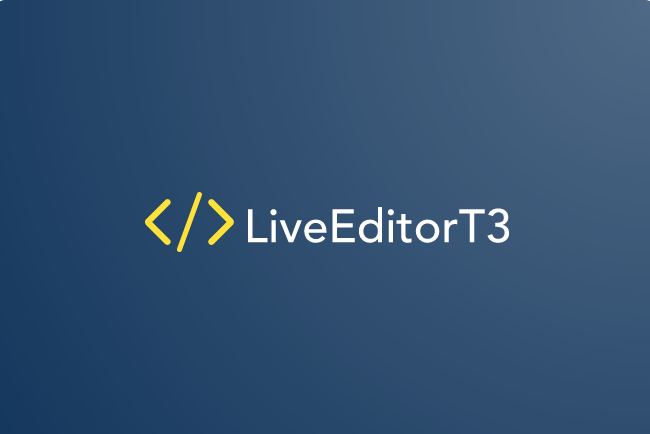

<div id="top"></div>

[![Contributors][contributors-shield]][contributors-url]
[![Forks][forks-shield]][forks-url]
[![Stargazers][stars-shield]][stars-url]
[![Issues][issues-shield]][issues-url]
[![MIT License][license-shield]][license-url]

<!-- PROJECT LOGO -->
<br />
<div align="center">
  <a href="https://github.com/LiveEditorT3/live-coding-editor-web">
    
  </a>

<h3 align="center">Live Coding Editor</h3>

  <p align="center">
    Make it collaborative! The code editor for your lecture
    <br />
    <a href="https://github.com/LiveEditorT3/live-coding-editor-web"><strong>Explore the docs »</strong></a>
    <br />
    <br />
    <a href="https://live-coding-editor-web.herokuapp.com/">View Demo</a>
    ·
    <a href="https://github.com/LiveEditorT3/live-coding-editor-web/issues">Report Bug</a>
    ·
    <a href="https://github.com/LiveEditorT3/live-coding-editor-web/issues">Request Feature</a>
  </p>
</div>

<!-- TABLE OF CONTENTS -->
<details>
  <summary>Table of Contents</summary>
  <ol>
    <li>
      <a href="#about-the-project">About The Project</a>
      <ul>
        <li><a href="#built-with">Built With</a></li>
      </ul>
    </li>
    <li>
      <a href="#getting-started">Getting Started</a>
      <ul>
        <li><a href="#prerequisites">Prerequisites</a></li>
        <li><a href="#installation">Installation</a></li>
      </ul>
    </li>
    <li><a href="#usage">Usage</a></li>
    <li><a href="#roadmap">Roadmap</a></li>
    <li><a href="#contributing">Contributing</a></li>
    <li><a href="#license">License</a></li>
    <li><a href="#contact">Contact</a></li>
    <li><a href="#acknowledgments">Acknowledgments</a></li>
  </ol>
</details>

<!-- ABOUT THE PROJECT -->

## About The Project

Collaborative code editor developed for the course Taller de Programación III at [FIUBA](https://fi.uba.ar/)

<p align="right">(<a href="#top">back to top</a>)</p>

### Built With

- [React](https://reactjs.org/)
- [MaterialUI](https://mui.com/)
- [Fluid Framework](https://fluidframework.com/)
- [CodeMirror](https://codemirror.net/)
- [Firebase](https://firebase.google.com/)
- [Node](https://nodejs.org/)
- [Heroku](https://www.heroku.com)

<p align="right">(<a href="#top">back to top</a>)</p>

<!-- GETTING STARTED -->

## Getting Started

To get a local copy up and running follow these simple example steps.

### Prerequisites

You need to install npm first

```sh
npm install npm@latest -g
```

### Installation

1. Follow these steps to get a free API Key and Client ID for a GitHub OAuth App:
   [https://docs.github.com/en/developers/apps/building-oauth-apps/creating-an-oauth-app](https://docs.github.com/en/developers/apps/building-oauth-apps/creating-an-oauth-app)
2. Setup a free Firebase project for the app:
   [https://firebase.google.com/docs/web/setup](https://firebase.google.com/docs/web/setup)
3. Clone the repo
   ```sh
   git clone https://github.com/LiveEditorT3/live-coding-editor-web.git
   ```
4. Install NPM packages
   ```sh
   npm install
   ```
5. Copy the contents of `.env.example` to a file named `.env`
6. Enter your Client ID in `.env`
   ```sh
   REACT_APP_GITHUB_CLIENT_ID=
   ```
7. Enter the environment variables required for Firebase in `.env`
   ```sh
   REACT_APP_FIREBASE_API_KEY=
   REACT_APP_FIREBASE_PROJECT_ID=
   REACT_APP_FIREBASE_MESSAGING_SENDER_ID=
   REACT_APP_FIREBASE_APP_ID=
   REACT_APP_FIREBASE_MEASUREMENT_ID=
   ```
8. Start a local Fluid Framework server with `npx tinylicious`
9. Start the API server following the instructions:
   [https://github.com/LiveEditorT3/live-coding-editor-api](https://github.com/LiveEditorT3/live-coding-editor-api)
10. Start the app in development mode
    ```sh
    npm run dev
    ```

<p align="right">(<a href="#top">back to top</a>)</p>

<!-- CONTRIBUTING -->

## Contributing

Contributions are what make the open source community such an amazing place to learn, inspire, and create. Any contributions you make are **greatly appreciated**.

If you have a suggestion that would make this better, please fork the repo and create a pull request. You can also simply open an issue with the tag "enhancement".
Don't forget to give the project a star! Thanks again!

1. Fork the Project
2. Create your Feature Branch (`git checkout -b feature/AmazingFeature`)
3. Commit your Changes (`git commit -m 'Add some AmazingFeature'`)
4. Push to the Branch (`git push origin feature/AmazingFeature`)
5. Open a Pull Request

<p align="right">(<a href="#top">back to top</a>)</p>

<!-- LICENSE -->

## License

Distributed under the MIT License. See `LICENSE.txt` for more information.

<p align="right">(<a href="#top">back to top</a>)</p>

<!-- CONTACT -->

## Contact

- Federico Álvarez - falvareza@fi.uba.ar
- Horacio Lisdero - hlisdero@fi.uba.ar
- Lucas Medrano - lnmedrano@fi.uba.ar

Project Link: [https://github.com/LiveEditorT3/live-coding-editor-web/](https://github.com/LiveEditorT3/live-coding-editor-web/)

<p align="right">(<a href="#top">back to top</a>)</p>

<!-- ACKNOWLEDGMENTS -->

## Acknowledgments

- Logo made with [Looka](https://looka.com/)
- README template used [Best-README-Template](https://github.com/othneildrew/Best-README-Template)

<p align="right">(<a href="#top">back to top</a>)</p>

<!-- MARKDOWN LINKS & IMAGES -->
<!-- https://www.markdownguide.org/basic-syntax/#reference-style-links -->

[contributors-shield]: https://img.shields.io/github/contributors/LiveEditorT3/live-coding-editor-web.svg?style=for-the-badge
[contributors-url]: https://github.com/LiveEditorT3/live-coding-editor-web/graphs/contributors
[forks-shield]: https://img.shields.io/github/forks/LiveEditorT3/live-coding-editor-web.svg?style=for-the-badge
[forks-url]: https://github.com/LiveEditorT3/live-coding-editor-web/network/members
[stars-shield]: https://img.shields.io/github/stars/LiveEditorT3/live-coding-editor-web.svg?style=for-the-badge
[stars-url]: https://github.com/LiveEditorT3/live-coding-editor-web/stargazers
[issues-shield]: https://img.shields.io/github/issues/LiveEditorT3/live-coding-editor-web.svg?style=for-the-badge
[issues-url]: https://github.com/LiveEditorT3/live-coding-editor-web/issues
[license-shield]: https://img.shields.io/github/license/othneildrew/Best-README-Template.svg?style=for-the-badge
[license-url]: https://github.com/LiveEditorT3/live-coding-editor-web/blob/master/LICENSE.txt
